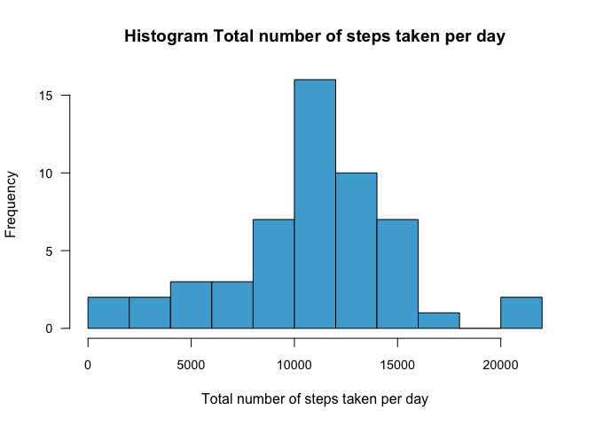
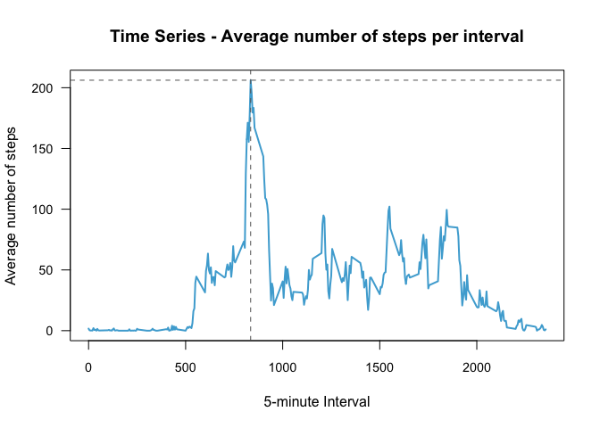
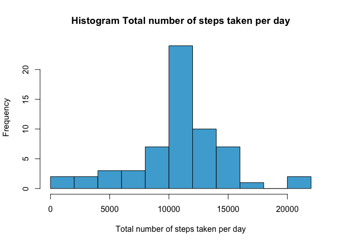

# Reproducible Research: Peer Assessment 1
### Introduction
This document contains my solution for 'Course Project 1' of the 'Reproducible Research' by Johns Hopkins University on the Coursera platform. This assignment makes use of data from a personal activity monitoring device. This device collects data at 5 minute intervals through out the day. The data consists of two months of data from an anonymous individual collected during the months of October and November, 2012 and include the number of steps taken in 5 minute intervals each day.

The dataset for this assignment can be downloaded here: [Activity Monitoring Data](https://github.com/dgroenhof/RepData_PeerAssessment1/blob/master/activity.zip)

While creating this document I assumed that the `activity.zip` file, needed to finish this assignment, is in the current working directory of your R environment. The remainder of this document will describe the R-code written to deliver the requested results and the output it provides.

### Loading Libraries
The first thing the script does is to load the additional three libraries needed for the rest of the R script to work properly.


```r
library(dplyr)
library(data.table)
library(lattice)
```


### Loading and preprocessing the data

```r
# unzip the activity.zip file
unzip("activity.zip")

# read the activity.csv file into the 'data' date.frame
data <- read.csv("activity.csv")

# change the factors into real date values
data$date <- as.Date(data$date, format = "%Y-%m-%d")
```

### What is mean total number of steps taken per day?


```r
sum.steps <-    subset(data, select = c(steps, date)) %>%  
                group_by(date) %>% 
                summarise(total.steps = sum(steps))
```


```r
hist(sum.steps$total.steps, 
     breaks = 10, 
     col="#4CACD6", 
     main = "Histogram Total number of steps taken per day", 
     xlab = "Total number of steps taken per day",
     mar = c(5,6,4,2), 
     las = 1, 
     cex.axis = 0.9, 
     cex.main = 1.2, 
     cex.lab = 1.0
         )
```




```r
cat("Mean: ", mean(sum.steps$total.steps, na.rm = TRUE))
```

```
## Mean:  10766.19
```


```r
cat("Median: ", median(sum.steps$total.steps, na.rm = TRUE))
```

```
## Median:  10765
```

### What is the average daily activity pattern?

```r
itv.steps <-   subset(data, select = c(steps, interval)) %>%  
                    group_by(interval) %>% 
                    summarise(average.steps = mean(steps, na.rm=TRUE))

max.steps <- max(itv.steps$average.steps)
max.steps.itv <- as.numeric(itv.steps[itv.steps$average.steps == max.steps,1])
```


```r
with(itv.steps, plot(interval, average.steps, type="l", lwd = 2, col="#4CACD6"))

abline(h = max.steps, lwd=1, lty=2, col="#666666")
abline(v = max.steps.itv, lwd=1, lty=2, col="#666666")
```



### Imputing missing values

```r
sum.na = sum(is.na(data$steps))

# Use mean for the interval if value for steps is missing (na)
data.imputed <- inner_join(data, itv.steps, by="interval")

data.imputed[is.na(data.imputed$steps), 1] <- data.imputed[is.na(data.imputed$steps), 4]

sum.steps.imputed <- subset(data.imputed, select = c(steps, date)) %>%  
    group_by(date) %>% 
    summarise(total.steps = sum(steps))
```


```r
cat("Mean: ", mean(sum.steps.imputed$total.steps))
```

```
## Mean:  10766.19
```


```r
cat("Median: ", median(sum.steps.imputed$total.steps))
```

```
## Median:  10766.19
```


```r
hist(sum.steps.imputed$total.steps, 
     breaks = 10, 
     col="#4CACD6", 
     main = "Histogram Total number of steps taken per day", 
     xlab = "Total number of steps taken per day"
)
```



### Are there differences in activity patterns between weekdays and weekends?

```r
daytype <- ifelse(weekdays(data.imputed$date) %in% c("Saturday","Sunday"), "weekend", "weekday")

data.imputed <- cbind(data.imputed, daytype)

itv.steps.imputed <-   subset(data.imputed, select = c(steps, interval, daytype)) %>%  
    group_by(interval, daytype) %>% 
    summarise(average.steps = mean(steps, na.rm=TRUE))
```


```r
xyplot(average.steps ~ interval | daytype, 
       itv.steps.imputed, 
       type = "l", 
       lwd = 1, 
       xlab = "Interval", 
       ylab = "Number of Steps", 
       layout = c(1,2)
      )
```


